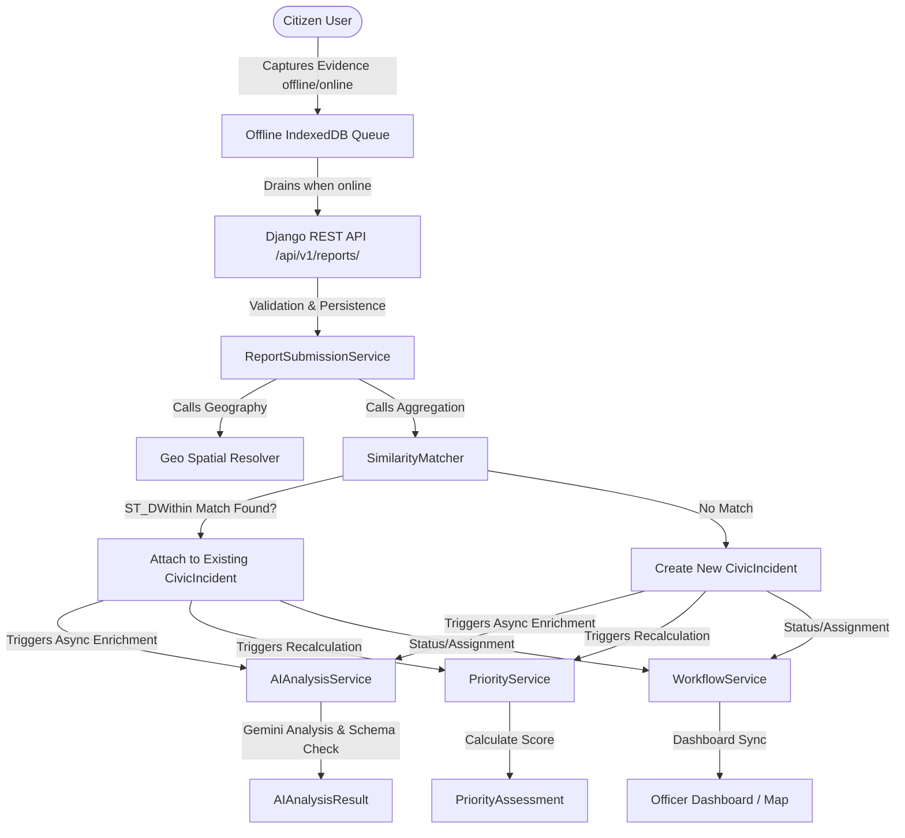

# SWC (Smart Waste Complaint) Platform

SWC (Smart Waste Complaint) is a modular monolith designed to streamline civic waste reporting, aggregation, and resolution. Built as a high-reliability platform, it enables citizens to capture and submit waste issues (with offline-first mobile web queue support) and leverages artificial intelligence to analyze media uploads, categorize complaints, and route them to local urban bodies (ULBs). The platform groups duplicate or near-duplicate reports geospatially and temporally into actionable civic incidents, prioritizing them dynamically using a multi-factor scoring service to optimize municipal resource allocation.

## The Problem Being Solved

Traditional civic complaint systems suffer from disjointed workflows, high rates of duplicate submissions, manual routing inefficiencies, and poor transparency for citizens. Local authorities are often overwhelmed by multiple reports of the same physical heap of trash, while citizens struggle to report issues in areas with low connectivity. SWC addresses these challenges by:
- Intelligently deduplicating multiple citizen complaints into single resolved incidents.
- Analyzing reports using AI to ensure correct classification, severity evaluation, and routing.
- Maintaining an offline queue for report capture in remote or poorly connected areas.
- Empowering officers with a prioritised dashboard to manage workloads based on SLA rules.

## Key Features

- **Offline-First Report Capture:** Media and GPS points are captured immediately on the client and stored in IndexedDB until connectivity is restored.
- **AI-Driven Visual Analysis:** Uses Gemini to identify category, verify evidence legitimacy, estimate severity, and detect objects.
- **PostGIS Geospatial Aggregation:** Intelligently groups reports near each other into single logical incidents, updating reporter counts dynamically.
- **Dynamic Prioritization Engine:** Versioned, multi-factor scoring (based on report count, severity, category, and area sensitivity) kept in an append-only audit trail.
- **Officer Dashboard:** Optimized geospatial map views and incident tables filtered by municipal jurisdiction.
- **Modular Architecture:** A clean modular monolith permitting independent development of domains with a clear path to future expansion (e.g. SURPLUS).

## SWC Workflow Diagram



## System Architecture Overview

SWC is built as a **modular monolith** structured into strict domain boundaries. Read the detailed [Architecture Blueprint](file:///c:/Users/krish/OneDrive/Desktop/swachsahyog/docs/architecture/blueprint.md) to understand:
- The domain boundaries and app dependencies.
- Database schemas (PostgreSQL + PostGIS mapping).
- Offline synchronization architecture using IndexedDB.
- AI validation and schema protection systems.
- Strategic plans for integrating the SURPLUS module later.

## Technology Stack

- **Backend:** Python, Django, Django REST Framework (DRF), PostGIS (PostgreSQL spatial extension)
- **Frontend:** React, JavaScript, Vite, TanStack Query, Vanilla CSS
- **AI & Analysis:** Google Gemini API
- **Infrastructure:** Docker, Docker Compose (PostgreSQL/PostGIS, Redis, Django, React)
- **Task Queue (Post-MVP):** Celery, Redis

## Repository Structure

```
swc-platform/
├── backend/                      # Django backend project
│   ├── config/                   # settings, urls, celery configurations
│   ├── apps/                     # Domain bounded apps (accounts, geography, etc.)
│   ├── core/                     # Shared kernel base classes, exceptions, and permissions
│   ├── api/                      # Routing layer for v1 endpoints
│   ├── manage.py                 # Django entrypoint
│   └── requirements/             # Dependency lists (base, dev, prod)
├── frontend/                     # React Single Page Application
│   ├── src/
│   │   ├── app/                  # App shell, router definitions, and provider wrappers
│   │   ├── routes/               # Route guard components and path constants
│   │   ├── pages/                # Page component directories (DashboardPage, SettingsPage, etc.)
│   │   ├── shared/               # Shared presentational components, hooks, formatting libs, and types
│   │   ├── services/             # Endpoint API clients (authApi, surplusApi, etc.)
│   │   └── main.jsx              # Main entry point
│   ├── index.html                # HTML mount point
│   ├── public/                   # Static assets
│   ├── vite.config.js            # Vite bundler options
│   └── package.json              # NPM manifest
├── infrastructure/               # DevOps and environment files
│   ├── docker/                   # Dockerfiles and Compose configurations
│   └── env/                      # Env templates
├── docs/                         # Platform documentation
│   ├── architecture/             # Architecture specifications and ADRs
│   ├── api/                      # OpenAPI schemas
│   └── domain/                   # Domain glossary and diagrams
└── tests/
    └── integration/              # Cross-domain integration test suites
```

## Local Development Setup

### Environment Variable Setup
1. Copy the root-level `.env.example` file to `.env`:
   ```bash
   cp .env.example .env
   ```
2. Open `.env` and fill in the required keys. Do not commit this file to Git.

### Backend Setup
1. Navigate to the backend directory:
   ```bash
   cd backend
   ```
2. Create and activate a Python virtual environment:
   ```bash
   python -m venv .venv
   # Windows:
   .venv\Scripts\activate
   # macOS/Linux:
   source .venv/bin/activate
   ```
3. Install development dependencies:
   ```bash
   pip install -r requirements/dev.txt
   ```
4. Perform migrations and seed initial data:
   ```bash
   python manage.py migrate
   python manage.py loaddata initial_geography
   ```

### Frontend Setup
1. Navigate to the frontend directory:
   ```bash
   cd frontend
   ```
2. Install package dependencies:
   ```bash
   npm install
   ```

### Database & PostGIS Setup
The application requires PostgreSQL with the PostGIS spatial extension.
If running locally without Docker:
1. Install PostgreSQL and the PostGIS extension package for your OS.
2. Create a database named `swc_db`:
   ```sql
   CREATE DATABASE swc_db;
   \c swc_db
   CREATE EXTENSION postgis;
   ```
3. Ensure your local `.env` has the correct `DATABASE_URL` credentials.

## How to Run the Project

### Using Docker Compose (Recommended)
Launch the entire stack (PostgreSQL/PostGIS, Django Backend, React Frontend):
```bash
docker-compose -f infrastructure/docker/docker-compose.yml up --build
```

### Running Services Separately
- **Backend Server:**
  ```bash
  cd backend
  python manage.py runserver
  ```
- **Frontend Vite Dev Server:**
  ```bash
  cd frontend
  npm run dev
  ```

## Testing Instructions

### Running Backend Tests
Execute unit and selector tests using `pytest`:
```bash
cd backend
pytest
```

### Running Integration Tests
Execute end-to-end service integration test suites:
```bash
pytest tests/integration/
```

### Running Frontend Tests
Execute component and unit tests:
```bash
cd frontend
npm run test
```

## API Documentation

Once the backend is running, you can explore the OpenAPI specifications and interactive docs at:
- Swagger UI: `http://localhost:8000/api/v1/docs/`
- ReDoc: `http://localhost:8000/api/v1/redoc/`
- Raw export available in `docs/api/openapi.json`

## Git & GitHub Contribution Rules

1. **Commit Hygiene:** Never commit secrets, passwords, `.env` files, virtual environments (`.venv/`), `node_modules/`, local SQL database files, or citizen-uploaded media to the repository.
2. **Branching Strategy:** Work on feature branches (`feature/feature-name`) branched from `main`. Submit a Pull Request for review.
3. **No Direct Writes to Foreign Models:** Backend services must not import or write to models owned by another Django app directly. Use services, selectors, or signals.
4. **Lint and Test:** Ensure all backend and frontend tests pass and linter checks succeed before opening a PR.

> [!WARNING]
> Any commits containing hardcoded credentials or `.env` secrets will be rejected immediately, and the credentials must be rotated.

## Future Roadmap (SURPLUS Integration)

The SWC architecture has been deliberately decoupled to accommodate the **SURPLUS** platform (surplus food/item redistribution) in the future without modifying core SWC code:
- **Shared infrastructure** (accounts, geography location tree, evidence media uploading, notifications, audit log) will be shared directly.
- **SURPLUS apps** (e.g. `surplus_items`, `surplus_transactions`) will sit beside existing apps.
- **Clean namespaces:** The API will expose `/api/v1/surplus/...` to avoid route overlap.

## SIH / Agriculture, FoodTech & Rural Development Context

This project was built under the Smart India Hackathon (SIH) framework under the "Agriculture, FoodTech & Rural Development" theme. It serves as a proof of concept for farmers, local food networks, and municipal authorities to optimize crop residue recycling, automate waste and resource logistics, and foster rural-urban circular economy participation through smart geospatial deduplication and automated routing.
