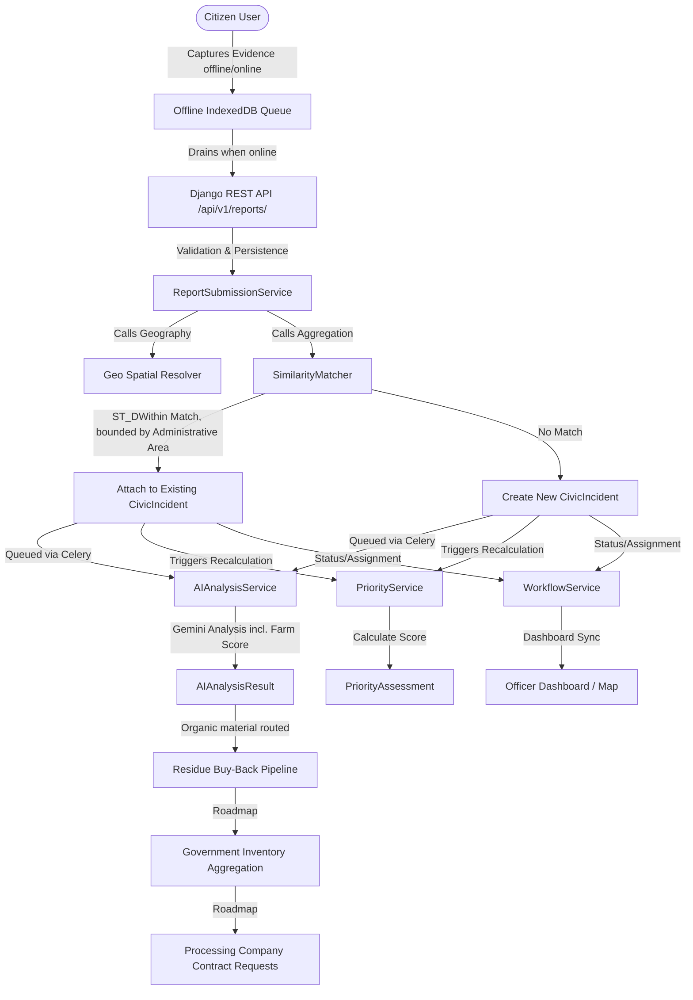

# GramSamridhi (SWC + Residue Buy-Back Platform)

GramSamridhi is a modular monolith that turns two disconnected rural
problems — civic waste complaints and crop residue disposal — into a single
government-mediated circular economy. Citizens report waste and offer
residue; the platform aggregates what comes in at the government level;
government becomes the buyer and, in turn, the negotiator that supplies
aggregated organic and recyclable material to registered processing
companies (biogas/CNG plants, organic fertilizer producers, recyclers)
under contract. Citizens and farmers never deal with processors directly —
government is the market-maker.

## The Problem Being Solved

Rural and peri-urban India has two chronic, related gaps:
- Citizens have no reliable channel to report waste, and municipal bodies
  have no way to deduplicate or prioritize the flood of overlapping reports
  that follow.
- Farmers burn or discard crop residue because there's no accessible,
  trustworthy buyer for it, and processing companies (biogas, fertilizer,
  recycling) have no visibility into how much recoverable material exists
  in a given area or how to source it reliably.

GramSamridhi addresses both by making local government the aggregation
point: it collects and deduplicates civic waste reports geospatially, buys
crop residue directly from farmers, rolls both into a running inventory of
organic and recyclable material, and exposes that inventory to registered
processing companies so government can negotiate supply contracts instead
of leaving farmers and citizens to find buyers on their own.

## Key Features

**Built and working:**
- **Offline-First Report Capture:** Media and GPS points are captured
  immediately on the client and stored in IndexedDB until connectivity is
  restored.
- **AI-Driven Visual Analysis:** Uses Gemini to identify category, verify
  evidence legitimacy, estimate severity, and estimate organic-material
  share ("Farm Score") for routing into the residue buy-back pipeline.
- **PostGIS Geospatial Aggregation:** Groups reports near each other into
  single logical incidents, bounded by administrative area, updating
  reporter counts dynamically.
- **Dynamic Prioritization Engine:** Versioned, multi-factor scoring (report
  count, severity, category, area sensitivity) kept in an append-only
  audit trail.
- **Officer Dashboard:** Geospatial map views and incident tables filtered
  by municipal jurisdiction.
- **Residue Buy-Back Flow:** Farmers request pickup of crop residue;
  government tracks and pays for it through a `requested → approved →
  collected → paid` status pipeline.
- **Async AI Pipeline:** Image classification runs as a Celery background
  task, not inline in the request cycle.

**Roadmap (not yet built — the differentiating layer):**
- **Government Inventory Aggregation:** Rolling totals of organic and
  recyclable material by administrative area, fed by paid buy-back records
  and resolved civic incidents.
- **Processing Company Registry:** Registration and capacity tracking for
  biogas/CNG plants, fertilizer producers, and recyclers.
- **Contract Negotiation Flow:** Processing companies request supply from
  aggregated government inventory; government reviews and approves/fulfills
  contracts. This is the mechanism that makes government the market-maker
  rather than a pass-through reporting tool, and it's the current
  development priority.
- **SURPLUS Module:** Agri-produce and food-surplus redistribution, and a
  trade-in channel for non-biotic recyclables, sitting beside the buy-back
  flow without restructuring existing domains.

## SWC Workflow Diagram



## System Architecture Overview

GramSamridhi is built as a **modular monolith** structured into strict
domain boundaries. Read the detailed
[Architecture Blueprint](docs/architecture/blueprint.md) to understand:
- The domain boundaries and app dependencies.
- Database schemas (PostgreSQL + PostGIS mapping).
- Offline synchronization architecture using IndexedDB.
- AI validation and schema protection systems.
- Plans for the government inventory/contract-negotiation layer and the
  SURPLUS module.

## Technology Stack

- **Backend:** Python, Django, Django REST Framework (DRF), PostGIS (PostgreSQL spatial extension)
- **Frontend:** React, JavaScript, Vite, TanStack Query, Vanilla CSS
- **AI & Analysis:** Google Gemini API
- **Task Queue:** Celery, Redis (image classification runs async, not inline)
- **Infrastructure:** Docker, Docker Compose (PostgreSQL/PostGIS, Redis, Celery worker, Gunicorn, React)

## Repository Structure

```
swc-platform/
├── backend/                      # Django backend project
│   ├── config/                   # settings, urls, celery configurations
│   ├── apps/                     # Domain bounded apps (accounts, geography, agriculture, surplus, etc.)
│   ├── core/                     # Shared kernel base classes, exceptions, and permissions
│   ├── api/                      # Routing layer for v1 endpoints
│   ├── manage.py                 # Django entrypoint
│   └── requirements/             # Dependency lists (base, dev, prod)
├── frontend/                     # React Single Page Application
│   ├── src/
│   │   ├── app/                  # App shell, router definitions, and provider wrappers
│   │   ├── routes/                # Route guard components and path constants
│   │   ├── pages/                 # Page component directories (DashboardPage, govtSide, AgricultureSide, etc.)
│   │   ├── shared/                # Shared presentational components, hooks, formatting libs, and types
│   │   ├── services/               # Endpoint API clients (authApi, agricultureApi, surplusApi, etc.)
│   │   └── main.jsx                # Main entry point
│   ├── index.html                 # HTML mount point
│   ├── public/                    # Static assets
│   ├── vite.config.js             # Vite bundler options
│   └── package.json               # NPM manifest
├── infrastructure/                # DevOps and environment files
│   ├── docker/                    # Dockerfiles and Compose configurations
│   └── env/                       # Env templates
├── docs/                          # Platform documentation
│   ├── architecture/              # Architecture specifications and ADRs
│   ├── api/                       # OpenAPI schemas
│   └── domain/                    # Domain glossary and diagrams
└── tests/
    └── integration/                # Cross-domain integration test suites
```

## Local Development Setup

### Environment Variable Setup
1. Copy the root-level `.env.example` file to `.env`:
   ```bash
   cp .env.example .env
   ```
2. Open `.env` and fill in the required keys. Do not commit this file to Git.

### Backend Setup
1. Navigate to the backend directory:
   ```bash
   cd backend
   ```
2. Create and activate a Python virtual environment:
   ```bash
   python -m venv .venv
   # Windows:
   .venv\Scripts\activate
   # macOS/Linux:
   source .venv/bin/activate
   ```
3. Install development dependencies:
   ```bash
   pip install -r requirements/dev.txt
   ```
4. Perform migrations and seed initial data:
   ```bash
   python manage.py migrate
   python manage.py loaddata initial_geography
   ```

### Frontend Setup
1. Navigate to the frontend directory:
   ```bash
   cd frontend
   ```
2. Install package dependencies:
   ```bash
   npm install
   ```

### Database & PostGIS Setup
The application requires PostgreSQL with the PostGIS spatial extension.
If running locally without Docker:
1. Install PostgreSQL and the PostGIS extension package for your OS.
2. Create a database named `swc_db`:
   ```sql
   CREATE DATABASE swc_db;
   \c swc_db
   CREATE EXTENSION postgis;
   ```
3. Ensure your local `.env` has the correct `DATABASE_URL` credentials.

## How to Run the Project

### Using Docker Compose (Recommended)
Launch the entire stack (PostgreSQL/PostGIS, Redis, Celery worker, Django Backend via Gunicorn, React Frontend):
```bash
docker-compose -f infrastructure/docker/docker-compose.yml up --build
```

### Running Services Separately
- **Backend Server:**
  ```bash
  cd backend
  python manage.py runserver
  ```
- **Celery Worker:**
  ```bash
  cd backend
  celery -A config worker -l info
  ```
- **Frontend Vite Dev Server:**
  ```bash
  cd frontend
  npm run dev
  ```

## Testing Instructions

### Running Backend Tests
Execute unit and selector tests using `pytest`:
```bash
cd backend
pytest
```

### Running Integration Tests
Execute end-to-end service integration test suites:
```bash
pytest tests/integration/
```

### Running Frontend Tests
Execute component and unit tests:
```bash
cd frontend
npm run test
```

## API Documentation

Once the backend is running, you can explore the OpenAPI specifications and interactive docs at:
- Swagger UI: `http://localhost:8000/api/v1/docs/`
- ReDoc: `http://localhost:8000/api/v1/redoc/`
- Raw export available in `docs/api/openapi.json`

## Git & GitHub Contribution Rules

1. **Commit Hygiene:** Never commit secrets, passwords, `.env` files, virtual environments (`.venv/`), `node_modules/`, local SQL database files, or citizen-uploaded media to the repository.
2. **Branching Strategy:** Work on feature branches (`feature/feature-name`) branched from `main`. Submit a Pull Request for review.
3. **No Direct Writes to Foreign Models:** Backend services must not import or write to models owned by another Django app directly. Use services, selectors, or signals.
4. **Lint and Test:** Ensure all backend and frontend tests pass and linter checks succeed before opening a PR.

> [!WARNING]
> Any commits containing hardcoded credentials or `.env` secrets will be rejected immediately, and the credentials must be rotated.

## Roadmap

- **Government Inventory & Contract Negotiation (current priority):** the
  aggregation layer described above — without it, this platform is a
  waste-complaint app with a residue marketplace bolted on, not a
  government-mediated circular economy. See `docs/architecture/blueprint.md`
  for the planned data model.
- **SURPLUS Module:** agri-surplus/food redistribution and non-biotic
  recyclable trade-in, sharing accounts, geography, evidence, and audit
  infrastructure with SWC; exposed under `/api/v1/surplus/...`.

## SIH / Agriculture, FoodTech & Rural Development Context

Built under Smart India Hackathon PS26197 ("Student Innovation," Agriculture/
FoodTech/Rural Development theme). The core proposal: local government
becomes the aggregator and market-maker for rural waste and crop residue —
buying directly from citizens and farmers, then negotiating supply contracts
with processing companies (biogas/CNG, organic fertilizer, recycling) on
their behalf — replacing informal burning/dumping and disconnected peer-to-
peer resale with a single, transparent, government-mediated channel.
